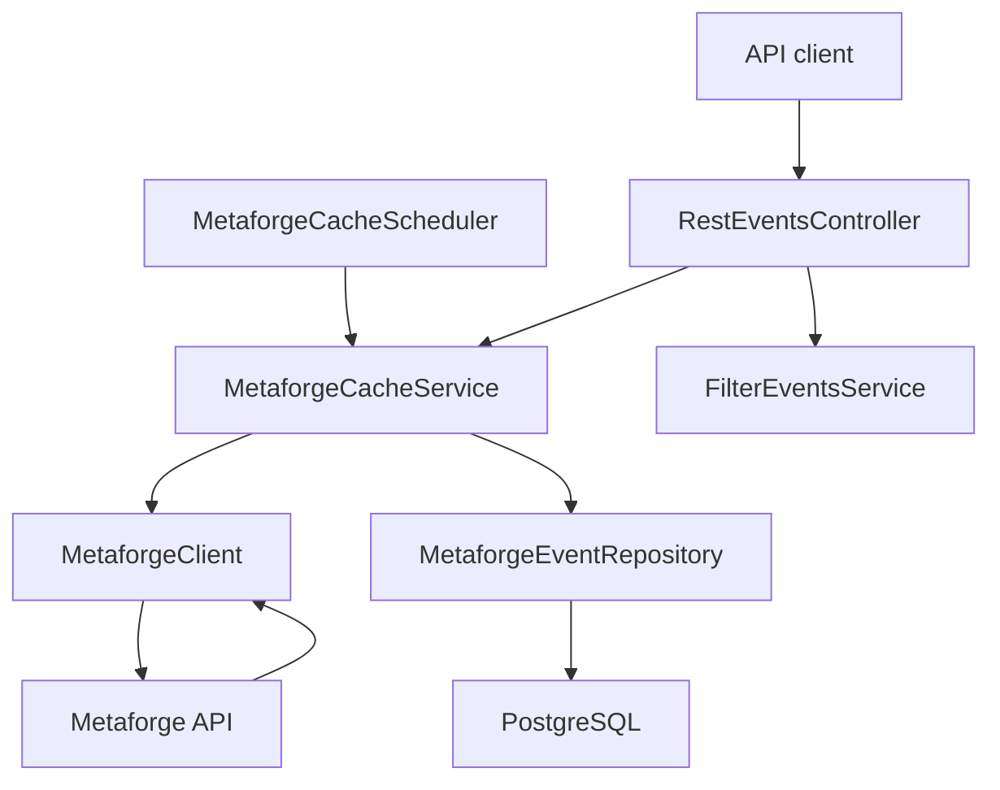

# ARC Raiders Event Tracker

A Spring Boot backend that retrieves scheduled ARC Raiders events from the external Metaforge API, stores them in
PostgreSQL, and exposes REST endpoints for retrieving and filtering the cached event schedule.

The project demonstrates external API integration, scheduled synchronization, relational persistence, DTO/entity
separation, filtering logic, validation, monitoring, and automated testing in a layered Java backend.

## Features

- Retrieves scheduled ARC Raiders events from the Metaforge API
- Periodically refreshes the local event cache through a configurable scheduler
- Persists event data in PostgreSQL with Spring Data JPA
- Inserts new events and updates existing events using a composite business key
- Provides a REST endpoint for retrieving all cached events
- Filters events by event name and map
- Supports multiple event/map filter pairs in a single request
- Returns sorted event start hours for filtered results
- Rejects incomplete or malformed filter requests with HTTP `400 Bad Request`
- Provides Spring Boot Actuator support
- Includes unit, controller, scheduler, persistence, and application-context tests

## Tech Stack

- Java 21
- Spring Boot 4.0.3
- Spring Web / `RestClient`
- Spring Data JPA / Hibernate
- PostgreSQL
- HikariCP
- Spring Scheduling
- Spring Boot Actuator
- Micrometer Prometheus Registry
- Maven
- Lombok
- JUnit 5
- Mockito
- H2 for tests

## Architecture



### Synchronization flow

1. `MetaforgeCacheScheduler` triggers a cache refresh.
2. `MetaforgeCacheService` requests the current schedule through `MetaforgeClient`.
3. `MetaforgeClient` calls the Metaforge `/events-schedule` endpoint.
4. The cache service converts the returned timestamps to `Instant` values.
5. Existing records are looked up by event name, map name, and start time.
6. New and existing entities are persisted in a batch through `saveAll(...)`.
7. Client requests are served from the local PostgreSQL database instead of calling the external API directly.

## Project Structure

```text
src/
├── main/
│   ├── java/com/grasmueck/arcraiderseventtracker/
│   │   ├── client/         # Metaforge API client
│   │   ├── config/         # RestClient configuration
│   │   ├── controller/     # REST endpoints
│   │   ├── dto/            # External and internal response models
│   │   ├── persistence/    # JPA entity and repository
│   │   └── service/        # Cache, scheduler, and filter logic
│   └── resources/
│       └── application.properties
└── test/
    ├── java/com/grasmueck/arcraiderseventtracker/
    │   ├── client/
    │   ├── controller/
    │   ├── persistence/
    │   └── service/
    └── resources/
        └── application-test.properties
```

## Requirements

- JDK 21
- PostgreSQL
- Git

The Maven Wrapper is included, so a separate Maven installation is not required.

## Database Setup

Create a PostgreSQL database named `arcdb`:

```sql
CREATE DATABASE arcdb;
```

The default development configuration expects:

| Setting  | Default value |
|----------|---------------|
| Host     | `localhost`   |
| Port     | `5432`        |
| Database | `arcdb`       |
| User     | `postgres`    |
| Password | `admin`       |

These values are intended for local development only and should be overridden outside a local environment.

### Optional: start PostgreSQL with Docker

```bash
docker run --name arc-raiders-postgres \
  -e POSTGRES_DB=arcdb \
  -e POSTGRES_USER=postgres \
  -e POSTGRES_PASSWORD=admin \
  -p 5432:5432 \
  -d postgres:16
```

## Configuration

Database settings can be supplied through environment variables:

| Environment variable |     Default | Description       |
|----------------------|------------:|-------------------|
| `DB_HOST`            | `localhost` | PostgreSQL host   |
| `DB_PORT`            |      `5432` | PostgreSQL port   |
| `DB_NAME`            |     `arcdb` | Database name     |
| `DB_USER`            |  `postgres` | Database user     |
| `DB_PASSWORD`        |     `admin` | Database password |

Example for Linux or macOS:

```bash
export DB_HOST=localhost
export DB_PORT=5432
export DB_NAME=arcdb
export DB_USER=postgres
export DB_PASSWORD=admin
```

Example for PowerShell:

```powershell
$env:DB_HOST = "localhost"
$env:DB_PORT = "5432"
$env:DB_NAME = "arcdb"
$env:DB_USER = "postgres"
$env:DB_PASSWORD = "admin"
```

### Scheduler configuration

The cache scheduler is enabled by default and can be configured with Spring properties:

```properties
metaforge.cache.enabled=true
metaforge.cache.initialDelayMs=5000
metaforge.cache.fixedDelayMs=300000
```

| Property                         |  Default | Description                                       |
|----------------------------------|---------:|---------------------------------------------------|
| `metaforge.cache.enabled`        |   `true` | Enables or disables scheduled synchronization     |
| `metaforge.cache.initialDelayMs` |   `5000` | Delay before the first refresh in milliseconds    |
| `metaforge.cache.fixedDelayMs`   | `300000` | Delay between completed refreshes in milliseconds |

## Running the Application

Clone the repository:

```bash
git clone https://github.com/grasmueckoliver/arc-raiders-event-tracker.git
cd arc-raiders-event-tracker
```

Run with the Maven Wrapper on Linux or macOS:

```bash
./mvnw spring-boot:run
```

Run on Windows:

```powershell
mvnw.cmd spring-boot:run
```

The API is available at:

```text
http://localhost:8080
```

By default, the scheduler performs its first Metaforge synchronization approximately five seconds after startup.

## Building the Application

Linux or macOS:

```bash
./mvnw clean package
```

Windows:

```powershell
mvnw.cmd clean package
```

Run the packaged application:

```bash
java -jar target/arc-raiders-event-tracker-0.5.0-SNAPSHOT.jar
```

## REST API

### Retrieve all cached events

```http
GET /events/all
```

Example:

```bash
curl http://localhost:8080/events/all
```

Example response:

```json
[
  {
    "name": "Bird City",
    "icon": "https://example.org/event-icon.webp",
    "startTime": 1772010000000,
    "endTime": 1772013600000,
    "map": "Buried City"
  }
]
```

`startTime` and `endTime` are returned as Unix timestamps in milliseconds.

### Filter event start times

```http
GET /events/filtered?args={eventName}&args={mapName}
```

A filter consists of an event-name/map-name pair. Multiple pairs can be supplied in the same request.

Single filter example:

```bash
curl --get "http://localhost:8080/events/filtered" \
  --data-urlencode "args=Bird City" \
  --data-urlencode "args=Buried City"
```

Multiple filters example:

```bash
curl --get "http://localhost:8080/events/filtered" \
  --data-urlencode "args=Bird City" \
  --data-urlencode "args=Buried City" \
  --data-urlencode "args=Uncovered Caches" \
  --data-urlencode "args=Blue Gate"
```

Example response:

```json
[
  {
    "name": "Bird City",
    "map": "Buried City",
    "times": [
      10,
      15,
      20
    ]
  },
  {
    "name": "Uncovered Caches",
    "map": "Blue Gate",
    "times": [
      1,
      13
    ]
  }
]
```

### Filter behavior

- Parameters must be supplied in event-name/map-name pairs.
- Fewer than two arguments result in `400 Bad Request`.
- An odd number of arguments results in `400 Bad Request`.
- Name and map matching currently use case-sensitive substring matching.
- Returned times are sorted hour-of-day values from `0` to `23`.
- Hours are calculated using the JVM's system time zone.

## Persistence Model

Events are stored in the `metaforge_event` table.

The combination of the following columns is unique:

```text
name + map_name + start_time
```

This business key is used during synchronization to distinguish new events from events that already exist and need to be
updated.

The application currently uses:

```properties
spring.jpa.hibernate.ddl-auto=update
```

This is convenient for local development. A production deployment should use explicit schema migrations such as Flyway
or Liquibase and switch Hibernate schema handling to `validate`.

## Testing

The project includes automated tests covering controller behavior, business logic, persistence, scheduling, API error
handling, and Spring configuration.

Run all tests on Linux or macOS:

```bash
./mvnw test
```

Run all tests on Windows:

```powershell
mvnw.cmd test
```

The test profile uses an H2 in-memory database and recreates the schema for each test context.

The current test suite covers:

- Spring application-context startup
- Metaforge client initialization and error handling
- Successful and empty controller responses
- Validation of missing, incomplete, and odd filter arguments
- Single and multiple filter pairs
- Filter-service invocation for every supplied pair
- Event and map matching
- Empty, null, partial-match, case-sensitivity, and sorting behavior
- Entity-to-DTO conversion
- Cache refreshes for new and existing events
- Null responses and null response data from the external API
- Scheduler delegation and exception containment
- Repository persistence and lookup by the composite business key

## Monitoring

Spring Boot Actuator is included. The default health endpoint is available at:

```text
GET /actuator/health
```

The Prometheus registry is also included.
```properties
management.endpoints.web.exposure.include=health,info,prometheus
```

Metrics are available at:

```text
GET /actuator/prometheus
```

## External Data Source

Event data is retrieved from:

```text
https://metaforge.app/api/arc-raiders/events-schedule
```

The application depends on the availability and response format of this external API. The local PostgreSQL cache reduces
the need to call the external service for every client request.

## Roadmap

- Add Docker Compose for the application and PostgreSQL
- Add GitHub Actions for automated build and test execution
- Add Flyway database migrations
- Add OpenAPI / Swagger documentation
- Replace array-based filter parameters with a typed request model
- Make the Metaforge base URL and response time zone configurable
- Add a frontend for visual event schedules

## Disclaimer

This is an unofficial community and portfolio project. It is not presented as an official ARC Raiders, Embark Studios,
or Metaforge product.

## License

No explicit open-source license has been added yet. Until a license is provided, the source code remains protected by
the default copyright rules.
